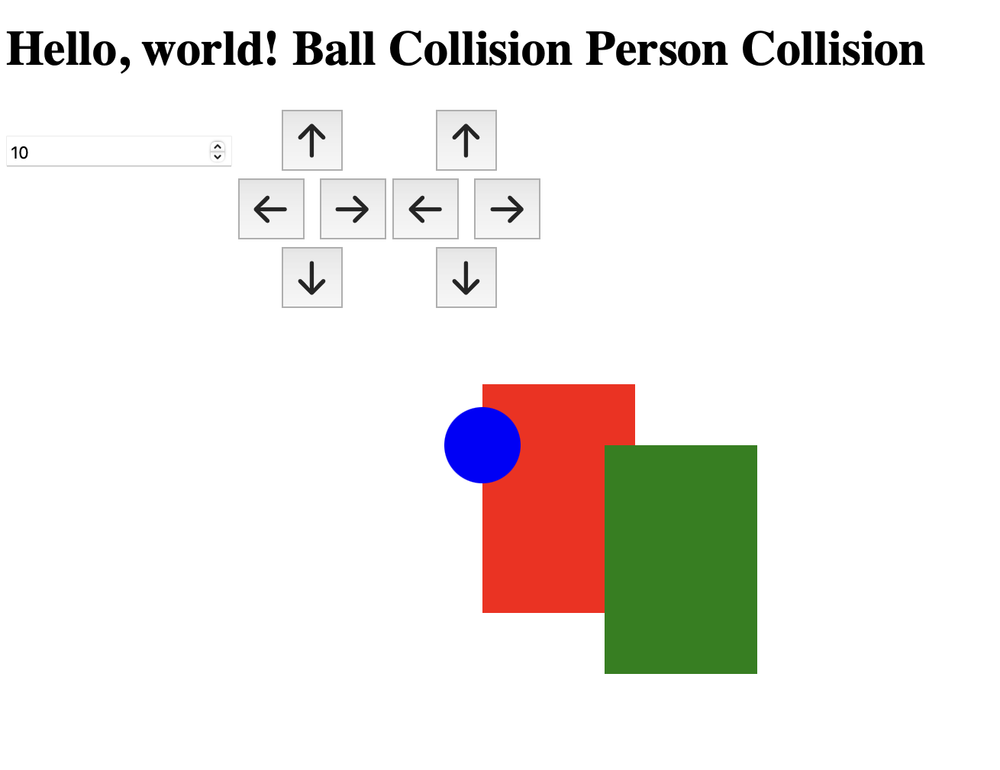

# Custom Collision Engine

This repository contains a custom collision engine implemented in .NET, split into three main projects: `Collider`, `Client`, and `BlazorClient`. These projects provide collision detection logic and demonstrate different collision scenarios in both console and web applications.



## Projects

### 1. Collider
The `Collider` project contains the core collision detection logic. The primary components are:
- **CollisionEngine**: Manages collision checks between objects.
- **Collision Specifications**: Defines collision scenarios, such as:
    - Circle-to-Circle
    - Circle-to-Rectangle
    - Rectangle-to-Rectangle

### 2. Client
`Client` is a simple console application for testing the collision engine in a terminal environment. This project allows you to interact with the `CollisionEngine` directly and observe collision outcomes through text-based feedback.

#### Usage
1. Open a terminal and navigate to the `Client` directory.
2. Run the application:
   ```bash
   dotnet run
   ```
3. Follow the prompts to test various collision scenarios.

### 3. BlazorClient
The `BlazorClient` project is a Blazor WebAssembly app that provides a graphical representation of collisions. It includes three main visual objects:
- A **circle** representing a "ball."
- Two **rectangles** representing "persons."

The engine, from `Collider`, detects and displays collisions between the circle and the rectangles in real time.

#### Key Components
- **MainLayout.razor**: Sets up the main layout for the Blazor application.
- **CollisionTest.razor**: Manages the collision detection state and renders the graphical objects. When a collision is detected, it shows text indicators for "Ball Collision" or "Person Collision."

#### Running the Blazor App
1. Navigate to the `BlazorClient` directory.
2. Start the application:
   ```bash
   dotnet run
   ```
3. Open the application in a compatible browser to see the collision engine in action.

## Getting Started

### Prerequisites
- [.NET SDK](https://dotnet.microsoft.com/download) (latest version recommended)
- Compatible browser for Blazor WebAssembly

### Installation
1. Clone this repository:
   ```bash
   git clone https://github.com/mhdbouk/CollisionEngine.git
   cd CollisionEngine
   ```
2. Restore dependencies for each project:
   ```bash
   dotnet restore
   ```

## Usage

- **Collider**: Use this as a library for custom collision detection logic.
- **Client**: A console-based testing interface for collision logic.
- **BlazorClient**: Web-based visualization to observe real-time collision detection.

## Contributing

Feel free to open issues, fork the repository, and submit pull requests. For major changes, please open a discussion first.

## License

This project is licensed under the MIT License - see the [LICENSE](LICENSE) file for details.
